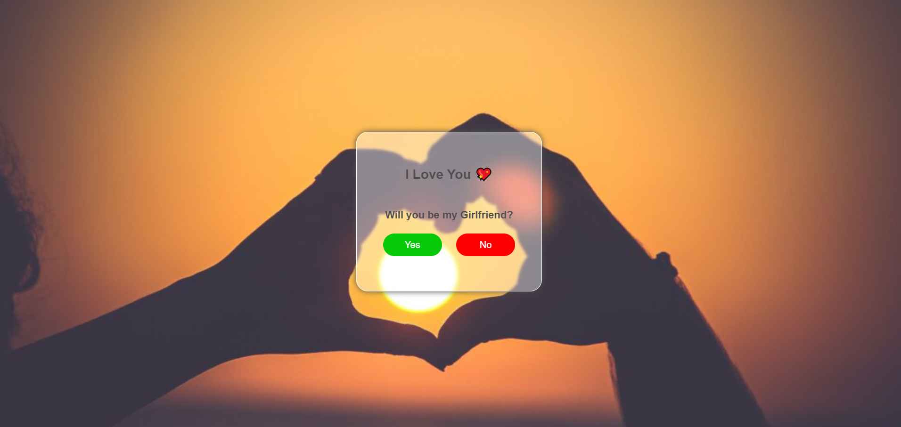
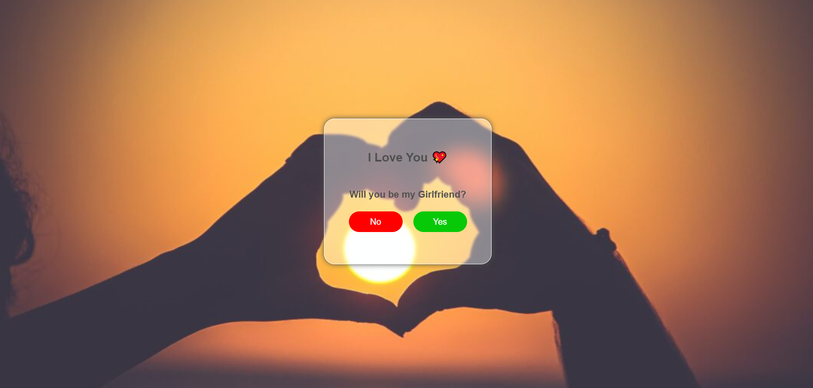

# Proposal-Portal
Proposal website to ask her yes or no.

<h2>You shoud know</h2>
<ul>
  <li>Website is made with HTML, CSS and JavaScript</li>
  <li>when user click on "No", it will change to "Yes"</li>
  <li>There is no chance to say No 😂</li>
</ul>

